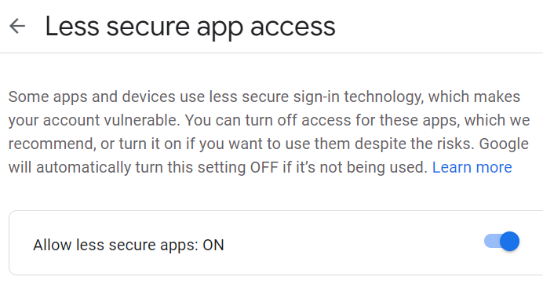
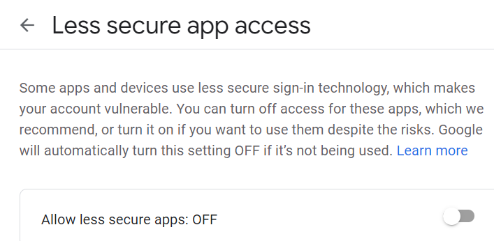
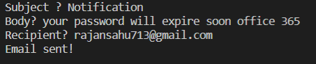
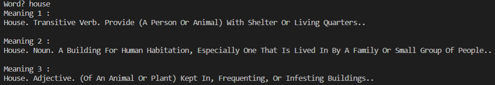
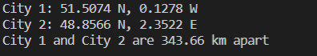

# Assignment

## 1. To run the send_email.py
#### First, you have to open any web browser(Internet Explorer, Google Chrome, Mozilla Firefox ...) and type "less secure apps gmail" without double-quote.



#### Turn it ON



Now, To run the code
```console
python send_email.py
```

```console
# Input format
Subject? <user inputs subject>
Body? > <user inputs a one line email body>
Recipient? <user inputs the email address of the recipient>

# Result
Email sent!
```

### Screenshot:
<br><br>


<br><br>
## 2. To run the dictionary_search.py

To run the code
```console
python dictionary_search.py
```

```console
# Input format
Word? <user inputs a word>(Ex – “House”)

# Result
Meaning 1 :
House. Transitive Verb. Provide (A Person Or Animal) With Shelter Or Living Quarters..

Meaning 2 :
House. Noun. A Building For Human Habitation, Especially One That Is Lived In By A Family Or Small Group Of People..

Meaning 3 :
House. Adjective. (Of An Animal Or Plant) Kept In, Frequenting, Or Infesting Buildings.
```

### Screenshot:
<br><br>


<br><br>
## 3. To run the dictionary_search.py

To run the code
```console
python dictionary_search.py
```

```console
# Input format
City 1: 51.5074 N, 0.1278 W
City 2: 48.8566 N, 2.3522 E

# Result
City 1 and City 2 are 343.66 km apart
```

### Screenshot:
<br><br>

